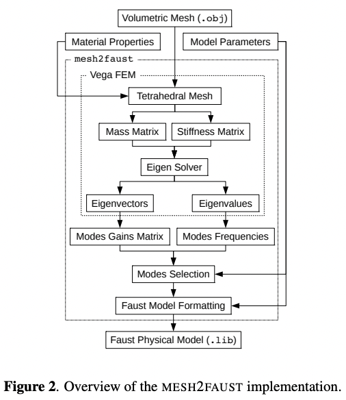

# mesh2audio

Convert a volumetric mesh to a physical audio model. Based on [mesh2faust](https://hal.science/hal-03162901/document).

## `mesh2faust` architecture

## Why?

Convert 3D meshes to a physical audio model with real-time excitable vertices - what's not to love?

3D meshes are everywhere.
We use them for visual rendering, but they can also be interpretted as physically plausible models for converting impulse forces into realistic audio responses (esp. when paired with material properties).
For example, striking a bell.

An implementation already exists (mesh2faust).
So what's missing?

- Very slow to compile.
  - "To give you an idea, analyzing a mesh with ~3E4 faces will probably take about 15 minutes on a regular laptop"
    - https://ccrma.stanford.edu/~rmichon/faustTutorials/#converting-a-mesh-to-a-faust-physical-model
  - todo measure perf on my machine as a baseline (KH)
- No visual interface at all.
  - Can't control mesh in real-time.
    (It relies on the user exporting a mesh from something like OpenScad->MeshLab, in a compatible format.)
- Limited configuration
  - E.g. constants representing material properties are baked in.
    Changing constants requires a full recompilation.
- Implementation relies on compiling to Faust, which introduces a dependency and likely a significant part of the compile times.
- Aspects of implementation obscured by 3rd party libraries (Vega FEM)
  - Also uses MKL, which is closed source

## Use cases

- Convert mesh + material props to real-time playable digital audio instrument
- Add audio to 3D animations
- Subcomponent for more complex downstream models like a physically-plausible video2audio?
  (Estimate time-varying meshes + materials from video. Estimate collisions between meshes. Convert vertices + materials + collisions to audio stream.)

## Proposal rough work plan

As you suggested, it probably makes sense to treat the FEM model as a library, and divide work between the library and the clientside stuff.

There's actaully a ton of work needed on the client side, so maybe that would be a clean way to divide work.

- Ben:
  - **Render an input volumetric mesh to mass/stiffness eigenvectors & eigenvalues.** (Everything in the "Vega FEM" box above.)
  - Given volumetric mesh (as an `.obj` file) & material properties (as `.mtl` file? GLTF? custom data structure?), produce:
    - Tetrahedral mesh -> (Mass/stiffness matrices) -> Eigen solver -> (Eigenvectors, Eigenvalues)
- Karl:
  - **Generate FEM inputs (mesh, materials), and render the FEM outputs to a modal physical audio model.** (Everything outside of the "Vega FEM" box.)
  - UI/UX/audio/mesh generation & editing
  - Provide volumetric mesh & material properties to FEM.
  - Take eigenvectors and eigenvalues from "Vega FEM" output, translating them to modes gain/frequency matrices.
  - Implement physical audio model parameter editor
  - Given model parameters + mass/stiffness eigenvectors/eigenvalues:
    - Produce (Gain/frequency matrices) -> Modes selection -> Audio rendering
  - Continuously fill the audio buffer based on the current mesh modes.
    - Initially implement using `mesh2faust->faust`, JIT rendering Faust to LLVM for runtime audio graph updates.
    - Next, render Faust->Julia->LLVM, JIT-loading LLVM on changes.
    - Next, render mesh modes directly to Julia, without Faust inbetween.
      - Measure performance improvement from skipping Faust compilation.
        Goal is real-time editing.

What if the interface for generating/manipulating meshes only handled one specific kind of operation - editing a 2D profile, and revolving it around an axis to create a 3D volumetric mesh.

The FEM and modal modeling would still all be more general, but I'm thinking of ways to focus/scope the UI editing part.
Could even just support parametrically generating bell meshes (mesh2faust references T. D. Rossing and R. Perrin, “Vibrations of Bells).

## Stack

- FEM:
  - Fortran?
  - ... (Ben)
- App: UI/UX/mesh/audio generation & editing
  - [ImGui](https://github.com/ocornut/imgui) + [SDL3](https://github.com/libsdl-org/SDL): Immediate-mode UI/UX, supporting many environments & backends.
  - [GLTF 2.0](https://github.com/KhronosGroup/glTF): Mesh+material(+much more) format. Transmit and load 3D scenes and models efficiently.
    Minimize the size of 3D assets, and their unpack runtime.
  - [Filament](https://github.com/google/filament): Real-time physically based rendering library.
    GLTF loader/viewer/editor.
  - [Faust](https://github.com/grame-cncm/faust): Render the mesh to an audio graph, with real-time interactive vertex excitation.
  - [miniaudio](https://github.com/mackron/miniaudio): Continuously render the modal physical model of the input 3D volumetric mesh to audio.
  - [ImPlot](https://github.com/epezent/implot/): For plotting

## Build app

### Build using script

In the `app` directory, run `./BuildApp`.
By default, this will create a debug build in the `build-debug` directory.
Run `./BuildApp --release` to create a release build in the `build` directory.

VSCode settings are also provided to open the root `mesh2audio` directory as a project, and build the app in `app/build`.
